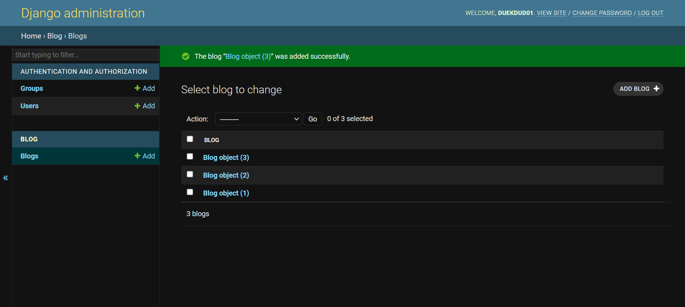

## 장고의 관리자 페이지


### 슈퍼 유저 생성

```bash
python manage.py createsuperuser

#Username, Email address, Password ... 는 기억 할 수 있는 정보로 해야 로그인 페이지에서 로그인 가능!
```


### 관리자 페이지 접속

```bash
#python manage.py runserver
http://127.0.0.1:8000/admin
```


### 관리자 페이지에 모델(Models) 등록

```bash
#blog/admin.py
#어플리케이션의 models.py에서 정의한 class를 가져온다.
#관리자 페이지에 해당 class를 등록한다.

from .models import Blog

admin.site.register(Blog)
```


### 관리자 페이지로 블로그 글 작성




*그런데 이때, 블로그 제목이 Blog object로 보기 불편하게 되어있다.

*자신이 작성한 제목으로 블로그 제목을 설정하고 싶다면

```bash
#blog/models.py

class Blog(models.Model):
    title = models.CharField(max_length=200)
    writer = models.CharField(max_length=100)
    pub_date = models.DateTimeField()
    body = models.TextField()

	#Blog 객체 안에 자기 자신을 호출하는 함수를 정의
    def __str__(self):
        return self.title
```
